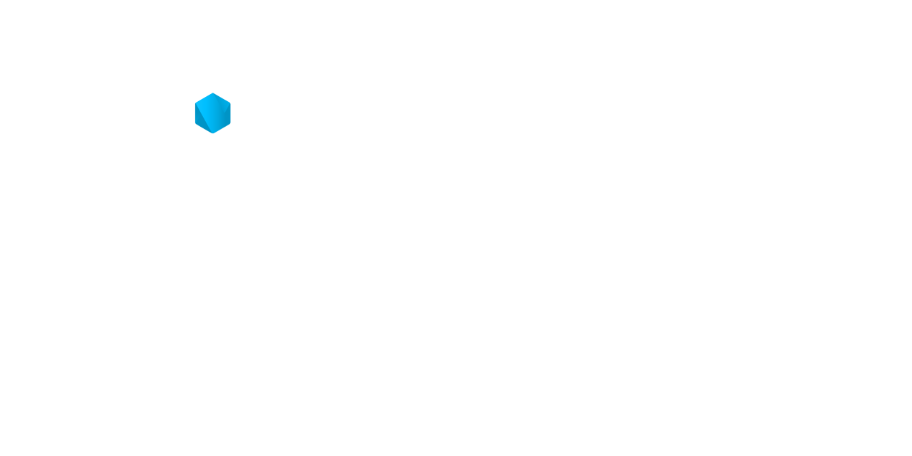

<p align="center">
  <picture>
    <source media="(prefers-color-scheme: dark)" srcset="assets/imgbb-node-dark.png">
    <source media="(prefers-color-scheme: light)" srcset="assets/imgbb-node-light.png">
    
  </picture>
</p>


[](https://github.com/rgbpx/imgbb-node/actions/workflows/ci.yml)
[](https://github.com/rgbpx/imgbb-node/actions/workflows/github-code-scanning/codeql)
[](https://github.com/rgbpx/imgbb-node/actions/workflows/dependabot/dependabot-updates)

# imgbb-node

Lightweight ImgBB client for Node.js (and Bun) written in TypeScript with zero dependencies

## Requirements

- Node.js version: `>= 20` (Apr 17, 2023)
- Bun version: `>= 1.0.36` (Mar 29, 2024)

## Installation

Install the package via `npm`:

```sh
npm install imgbb-node
```

Install the package via `bun`:

```sh
bun add imgbb-node
```

## Documentation

- [File Upload](#file-upload)

---

### File Upload

Uploads a file to ImgBB from a `File`.

Throws for invalid inputs or upload failures and error responses.

```js
import { uploadFile } from "imgbb-node";

const data = await readFile("/path/to/image.jpeg");
const file = new File([data], "image.jpeg", { type: "image/jpeg" });
const controller = new AbortController();
setTimeout(() => controller.abort(), 5_000); // abort after 5 seconds

const {
  data: { url },
} = await uploadFile(file, {
  key: "MY_IMGBB_API_KEY",
  name: "my_file_image",
  expiration: 60,
  signal: controller.signal,
});
```
